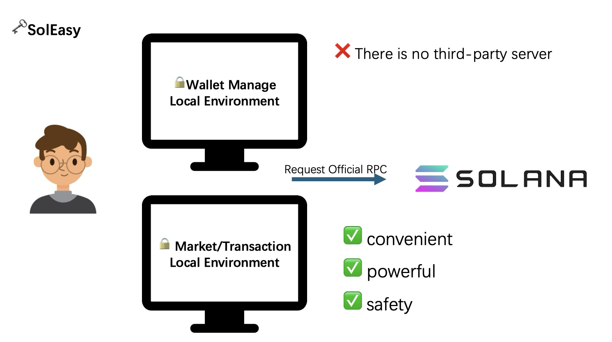
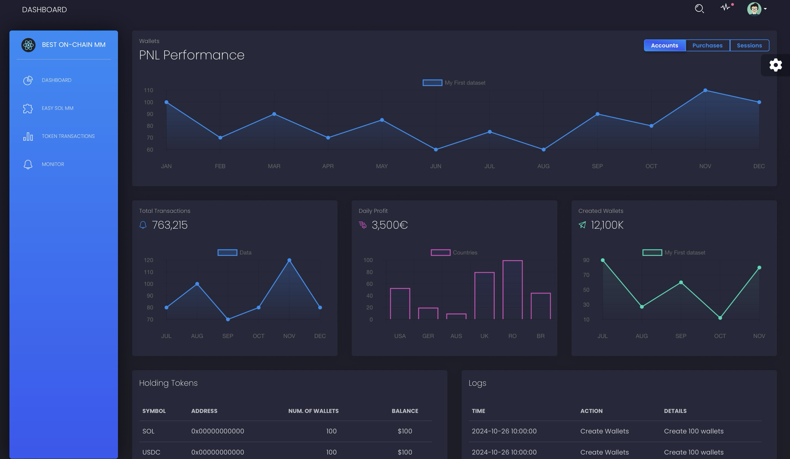
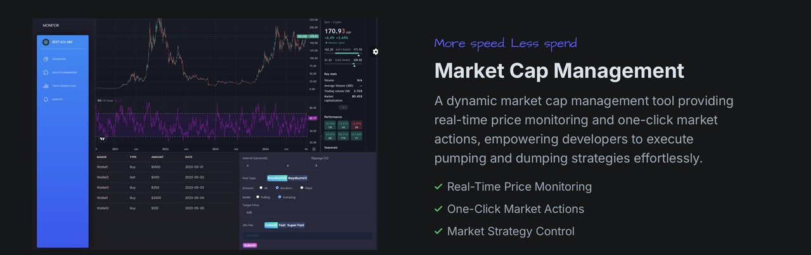
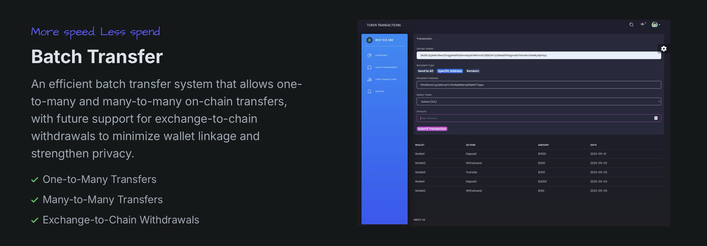

# 👋 Welcome to SolEasy

🔗 Live Demo: http://132.145.49.82/

## 🔥 Project Summary

SolEasy is a comprehensive solution for on-chain market management and asset growth, crafted to address the significant gap in secure, transparent on-chain **market-making tools.** Designed for users who need to efficiently manage wallets, monitor market trends, and conduct secure transactions, SolEasy empowers both **beginners**,  seasoned **blockchain users** and **Developers** with robust market-making tools. 

Key features include **real-time** token price monitoring, bulk wallet creation, secure market cap management, and efficient batch asset transfer capabilities. With its intuitive interface and powerful backend, SolEasy ensures that users can effectively **manage** and grow their on-chain assets, providing a **trustworthy**, **user-friendly** **alternative** in a market where transparent and safe on-chain tools are limited.


### 🔑 Key Features

1.  **Data Dashboard**
2.  **Wallet Management**
3.  **Batch Transfer**
4.  **Market Cap Management**



## 📃 Overview

### Technology stack

#### **Frontend**

-   **React**: The user interface is built with React, providing a smooth and responsive user experience.
-   **Reactstrap**: Used for UI components to create a visually appealing and user-friendly layout.
-   **Next.js**: Utilized for rapid development of the project’s main homepage, offering server-side rendering and improved performance for SEO-friendly content delivery.

#### **Backend**

-   **Python & FastAPI**: FastAPI provides a fast, scalable backend framework for handling API requests efficiently.
-   **SQLite**: Lightweight relational database for storing wallet data and transaction history, ideal for quick access and storage.

#### **Security**

-   **Encryption**: Ensures sensitive calculations and wallet data are protected during transit and storage, providing robust protection against unauthorized access.
-   **CORS**: Configured to securely handle cross-origin requests, allowing only authorized domains to interact with the backend API, thus preventing unauthorized access from untrusted sources.
-   **Local Storage (IndexedDB)**: All data is securely stored in the browser's local IndexedDB storage when running locally, ensuring that sensitive data remains on the client side without the need for external storage. This approach enhances data privacy and control, especially for offline use cases.

#### **Deployment**

  \- **Docker**: Containerized deployment for easy scalability and consistent environment setup.

## 🚀 Demo Img








## 🔧Setup Guide

###  Frontend Setup

1.   **Navigate to the Frontend Directory and Install Dependencies**:

```bash
   cd FrontEnd
   npm install
```

2.   **Run the Development Server**:

```bash   
   npm start
```

 \- Open your browser and go to [http://localhost:3000](http://localhost:3000) to access the frontend.

###  Backend Setup

1.   **Navigate to the Backend Directory**

```bash
   cd ../BackEnd
```

2.   **Install Python Dependencies**

```bash
   pip install -r requirements.txt
```

3.    **Run the Backend Server**

```bash
   fastapi run main.py
```

   \- The backend server will be available at [http://localhost:8000](http://localhost:8000).

----

With this setup, you should have both the frontend and backend servers running locally:

\- Frontend: [http://localhost:3000](http://localhost:3000)

\- Backend API: [http://localhost:8000](http://localhost:8000)

**You’re now ready to start developing on SolEasy!**

## 👑 Future Enhancements

- [ ] **Exchange-to-Chain Withdrawals**: For enhanced privacy and reduced wallet linkage.
- [ ] **Advanced Analytics**: More comprehensive data analysis tools for market performance.

-----

Contact Us：SolEasy.official@gmail.com